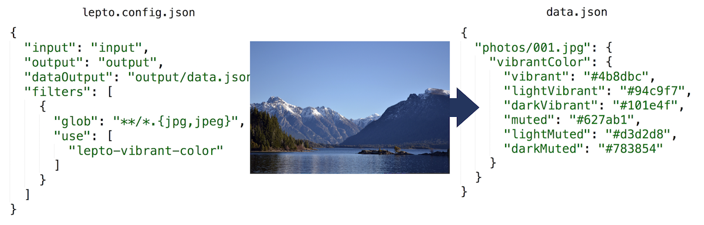

# lepto-vibrant-color

```console
$ npm i -D lepto-vibrant-color
```

See [lepto documentation](https://github.com/dimitrinicolas/lepto) for usage.

This plugin use the [`node-vibrant`](https://github.com/akfish/node-vibrant) module.

Default options:
```js
"use": [
  {
    "name": "lepto-vibrant-color"
  }
]
```



The different vibrant colors are:

* vibrant
* lightVibrant
* darkVibrant
* muted
* lightMuted
* darkMuted

## Usage advices

If you use an image as a css `background-image`, you can easily set the element's `background-color` to one of its vibrant color. Don't worry, `background-image` will always override `background-color` when the image is loaded. You could also use the `background` shortcut:

```html
<div class="some-class" style="background: #4b8dbc url(assets/output/image.jpg);"></div>
```

## License

This project is licensed under the [MIT license](LICENSE).
